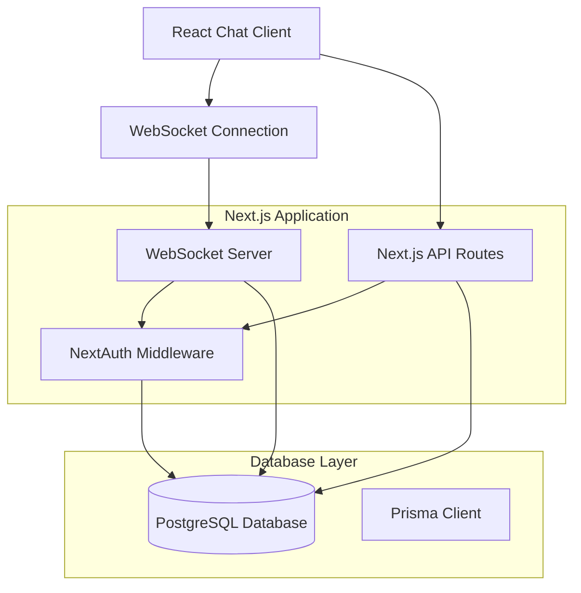
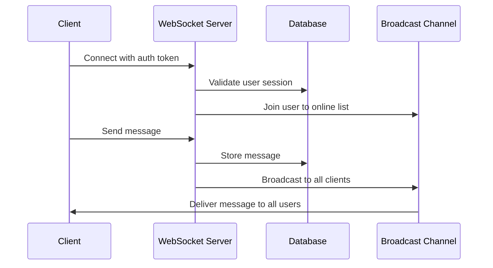

# Design Document

## Overview

The real-time chat foundation will transform the existing Next.js e-commerce application into a comprehensive chat platform while maintaining the current authentication and database infrastructure. The system will use WebSockets for real-time communication, extend the existing Prisma schema for chat functionality, and provide a responsive chat interface that integrates seamlessly with the current DaisyUI-based design system.

The architecture follows a client-server model where the Next.js application serves both the web interface and WebSocket server, with PostgreSQL handling persistent storage through the existing Prisma setup. This foundation will support future enhancements like voice/video calls, channels, servers, and dual workspace modes.

## Architecture

### High-Level Architecture



### WebSocket Architecture



## Components and Interfaces

### Database Schema Extensions

The existing Prisma schema will be extended with new models for chat functionality:

```prisma
model Message {
  id        String   @id @default(uuid()) @db.Uuid
  content   String   @db.Text
  userId    String   @db.Uuid
  createdAt DateTime @default(now())
  updatedAt DateTime @updatedAt
  
  user      User     @relation(fields: [userId], references: [id], onDelete: Cascade)
  
  @@index([createdAt])
}

model UserPresence {
  id           String    @id @default(uuid()) @db.Uuid
  userId       String    @unique @db.Uuid
  isOnline     Boolean   @default(false)
  lastSeen     DateTime  @default(now())
  socketId     String?   @unique
  
  user         User      @relation(fields: [userId], references: [id], onDelete: Cascade)
}

// Extend existing User model
model User {
  // ... existing fields
  messages     Message[]
  presence     UserPresence?
}
```

### WebSocket Server Implementation

**Location:** `src/lib/websocket-server.ts`

```typescript
interface WebSocketMessage {
  type: 'message' | 'typing' | 'user_joined' | 'user_left' | 'ping'
  payload: {
    content?: string
    userId: string
    username?: string
    timestamp?: string
    isTyping?: boolean
  }
}

interface ConnectedUser {
  userId: string
  username: string
  socketId: string
  lastActivity: Date
}
```

**Key Responsibilities:**
- Manage WebSocket connections and user sessions
- Handle message broadcasting to all connected clients
- Maintain online user presence and typing indicators
- Implement connection recovery and error handling
- Integrate with NextAuth for authentication validation

### Chat Client Components

**Main Chat Interface:** `src/components/chat/ChatContainer.tsx`
- Responsive layout with message list and input area
- Integration with existing DaisyUI theme system
- Real-time message rendering and scroll management
- Connection status indicators

**Message Components:**
- `MessageList.tsx` - Scrollable message history with pagination
- `MessageInput.tsx` - Input field with typing indicators and send functionality
- `OnlineUsers.tsx` - Display of currently connected users
- `ConnectionStatus.tsx` - WebSocket connection health indicator

**Hooks:**
- `useWebSocket.ts` - WebSocket connection management and message handling
- `useMessages.ts` - Message state management and history loading
- `useTyping.ts` - Typing indicator functionality

### API Routes

**WebSocket Endpoint:** `src/app/api/chat/ws/route.ts`
- Handles WebSocket upgrade requests
- Validates authentication tokens
- Manages connection lifecycle

**Message History:** `src/app/api/chat/messages/route.ts`
- GET: Retrieve paginated message history
- Supports cursor-based pagination for performance

**User Presence:** `src/app/api/chat/presence/route.ts`
- GET: Retrieve current online users
- POST: Update user presence status

## Data Models

### Message Flow

1. **Message Creation:**
   - User types message in chat input
   - Client validates message (length, content)
   - Message sent via WebSocket with user authentication
   - Server validates and stores in database
   - Server broadcasts to all connected clients

2. **Message History Loading:**
   - Client requests recent messages on connection
   - Server returns last 50 messages with pagination cursor
   - Client can request older messages by scrolling up
   - Infinite scroll implementation for smooth UX

3. **Real-time Updates:**
   - New messages broadcast immediately to all clients
   - Typing indicators sent with debounced updates
   - User presence changes propagated in real-time

### Authentication Integration

The chat system will leverage the existing NextAuth setup:

```typescript
// WebSocket authentication flow
interface AuthenticatedWebSocket extends WebSocket {
  userId: string
  sessionToken: string
  user: {
    id: string
    name: string
    email: string
    image?: string
  }
}
```

**Authentication Process:**
1. Client obtains session token from NextAuth
2. WebSocket connection includes token in headers
3. Server validates token against existing session store
4. Connection established with authenticated user context

## Error Handling

### WebSocket Connection Management

**Connection States:**
- `CONNECTING` - Initial connection attempt
- `CONNECTED` - Active WebSocket connection
- `RECONNECTING` - Attempting to restore connection
- `DISCONNECTED` - Connection lost, manual reconnection required

**Error Recovery:**
- Automatic reconnection with exponential backoff (1s, 2s, 4s, 8s, max 30s)
- Message queue for offline messages (stored locally, sent on reconnection)
- Connection health monitoring with periodic ping/pong
- Graceful degradation to polling if WebSocket fails

### Database Error Handling

- Transaction rollback for failed message storage
- Duplicate message prevention using client-side message IDs
- Presence cleanup for stale connections
- Database connection pooling and retry logic

### Client-Side Error Handling

- Message send failure indicators with retry options
- Connection status display in chat interface
- Offline message queuing with visual indicators
- Error boundaries for chat component failures

## Testing Strategy

### Unit Tests

**WebSocket Server Tests:**
- Connection authentication validation
- Message broadcasting functionality
- User presence management
- Error handling and recovery

**React Component Tests:**
- Message rendering and formatting
- Input validation and submission
- Real-time update handling
- Responsive design behavior

**Database Tests:**
- Message storage and retrieval
- User presence updates
- Query performance with large datasets
- Migration scripts for schema changes

### Integration Tests

**End-to-End Chat Flow:**
- User authentication and chat access
- Message sending and receiving
- Multiple user interactions
- Connection recovery scenarios

**Performance Tests:**
- Concurrent user connections (target: 1000+ users)
- Message throughput and latency
- Database query optimization
- Memory usage under load

### Manual Testing Scenarios

- Cross-browser WebSocket compatibility
- Mobile responsive design validation
- Network interruption recovery
- Multiple tab/window behavior

## Performance Considerations

### WebSocket Optimization

- Connection pooling and resource management
- Message batching for high-frequency updates
- Compression for large message payloads
- Rate limiting to prevent spam

### Database Optimization

- Indexed queries for message history retrieval
- Pagination cursors for efficient scrolling
- Connection pooling for concurrent users
- Archive strategy for old messages

### Frontend Performance

- Virtual scrolling for large message lists
- Debounced typing indicators
- Optimistic UI updates for sent messages
- Lazy loading of user avatars and media

## Security Considerations

### Authentication & Authorization

- WebSocket connections require valid session tokens
- Message validation and sanitization
- Rate limiting per user to prevent abuse
- CORS configuration for WebSocket origins

### Data Protection

- Message content encryption in transit (WSS)
- Input sanitization to prevent XSS attacks
- SQL injection prevention through Prisma
- User data privacy compliance

### Infrastructure Security

- WebSocket origin validation
- DDoS protection and rate limiting
- Secure session token handling
- Database access controls and encryption